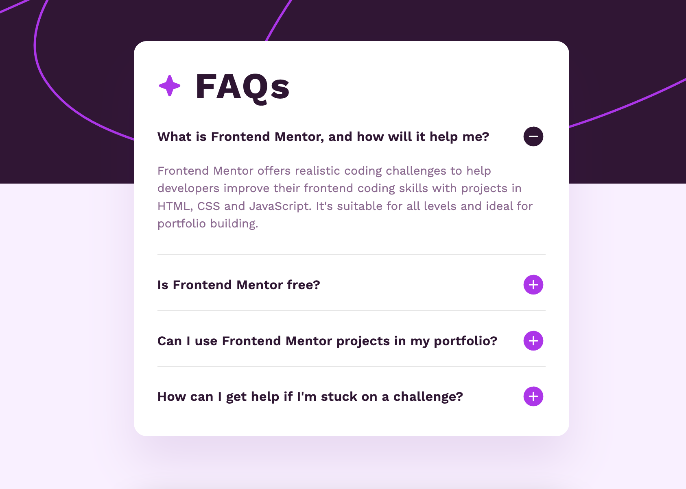

# Frontend Mentor - FAQ accordion solution

This is a solution to the [FAQ accordion challenge on Frontend Mentor](https://www.frontendmentor.io/challenges/faq-accordion-wyfFdeBwBz). Frontend Mentor challenges help you improve your coding skills by building realistic projects. 

## Table of contents

- [Overview](#overview)
  - [The challenge](#the-challenge)
  - [Screenshot](#screenshot)
  - [Links](#links)
- [My process](#my-process)
  - [Built with](#built-with)
  - [What I learned](#what-i-learned)
  - [Continued development](#continued-development)
- [Author](#author)

## Overview

### The challenge

Users should be able to:

- Hide/Show the answer to a question when the question is clicked
- View the optimal layout for the interface depending on their device's screen size
- See hover and focus states for all interactive elements on the page

### Screenshot

### Links

- Live Site URL: [Live Demo](https://faqaccordionhenn.netlify.app/)

## My process

### Built with

- Semantic HTML5 markup
- CSS custom properties
- Flexbox
- Vanilla JS

### What I learned

After working on several projects using libraries and frameworks such as React, Next.js and Tailwind.  I realized I was rusty on my origins.  This project was a return to my roots using strictly HTML, CSS and JS.  A fairly easy project that acted as a review but one that was much needed.

### Continued development

The completion of this project made me realize the importance of reviewing old concepts.  I plan to start another project using HTML, CSS and JavaScript to further solidify my foundations.

## Author

- Website - [Connor Henn](https://www.connorhenn.dev)
